# dnnls_final_project

A deep learning project that predicts the next frame in a comic-style story sequence using both image and text inputs. Three experiments are compared using the StoryReasoning dataset.

---

# Overview

Given four consecutive story frames (each with an image and a text description), the model predicts the fifth frame — both its image and its description.

---

# Dataset

**StoryReasoning** (`daniel3303/StoryReasoning`) from HuggingFace.

Each sample contains:

- A PIL image
- A GDI-formatted text description (objects, actions, locations)
- Chain-of-Thought (CoT) annotations with bounding boxes per character and object

The dataset is split 80/20 into training and validation sets.  
A held-out test set is also used.

---

# Architecture

## Text Encoder

- **Baseline:** LSTM encoder  
  Processes tokens left-to-right; the final hidden state is used as the text representation.

- **Innovation 1:** Transformer encoder  
  Uses self-attention to process all tokens simultaneously and supports explainability through attention heatmaps.

---

## Visual Encoder

- **Baseline:** 3-layer CNN trained from scratch.

- **Innovation 2:** ResNet-18 pretrained on ImageNet  
  Transfers rich visual features learned from large-scale image datasets to story frames.

Both encoders follow a **dual-pathway design** (content + context), whose outputs are concatenated and projected into a shared latent space.

---

## Text Decoder

LSTM decoder (identical across all experiments).

- Initialised from the fused latent vector
- Generates the predicted description

---

## Visual Decoder

Transposed convolution decoder (identical across all experiments).

- Reconstructs the predicted frame
- Uses the latent vector as input

---

# Full Sequence Predictor

1. Encode all 4 context frames (image + text separately)
2. Concatenate image and text embeddings per frame
3. Pass the 4-frame sequence through a temporal GRU
4. Apply an attention module over GRU outputs
5. Combine the GRU final state with the attention context vector
6. Decode the predicted image and text

---

# Experiments

Controlled via boolean switches in the config cell.  
Only the switches change between experiments — all hyperparameters remain fixed.

| Switch | Baseline | Exp 1 | Exp 2 |
|---|---|---|---|
| `USE_TRANSFORMER_ENCODER` | False | True | True |
| `USE_RESNET_ENCODER` | False | True | True |
| `USE_CONTRASTIVE_ROI` | False | False | True |

---

# Key Innovations

- Transformer-based text encoding
- ResNet-18 visual feature extraction
- Temporal GRU with attention
- ROI-aware contrastive learning
- Multimodal image + text prediction

---
# Training Pipeline - External Text Pretraining

- Transformer only: Stage A on WikiText-2 (general English structure), then Stage B on TinyStories (short character-action stories — closest freely available domain to comic descriptions).
- LSTM: Stage B on TinyStories only (already has provided pretrained weights; fine-tuned gently).

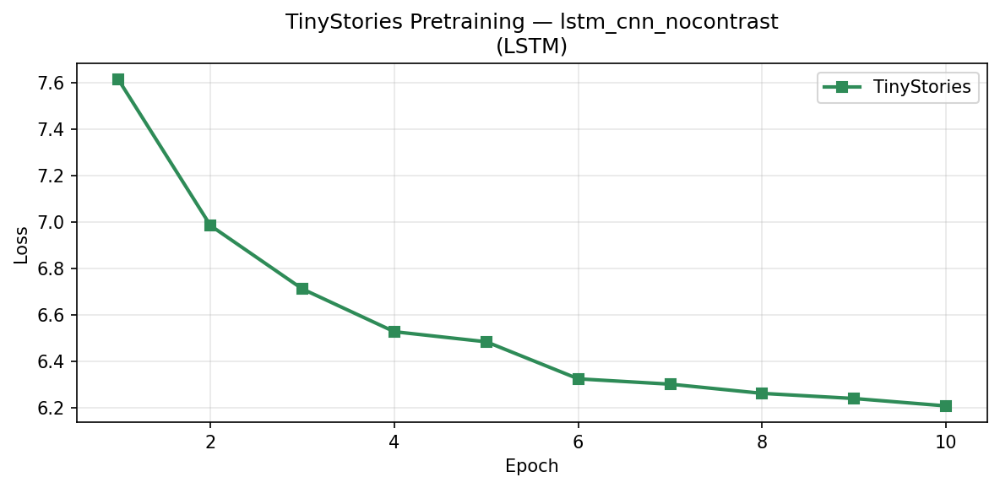
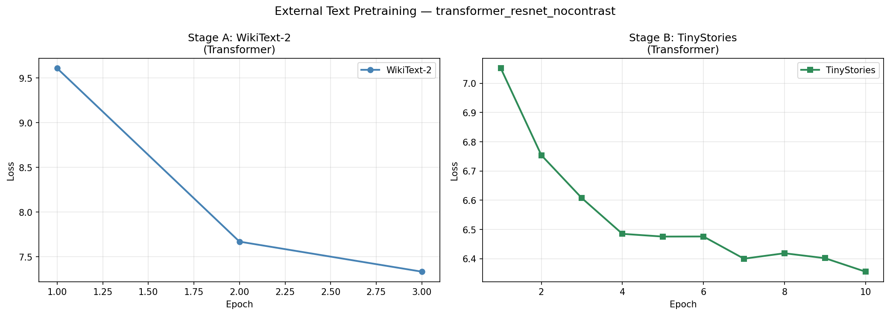
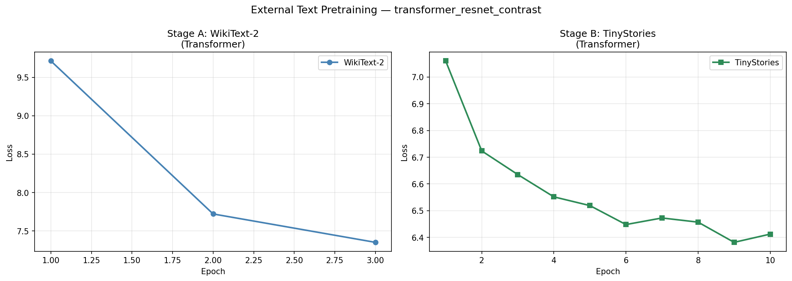

# StoryReasoning Text Fine-tuning

- Both encoders are fine-tuned on StoryReasoning story descriptions. Best checkpoint is selected by validation loss. Text encoder is then frozen.
  
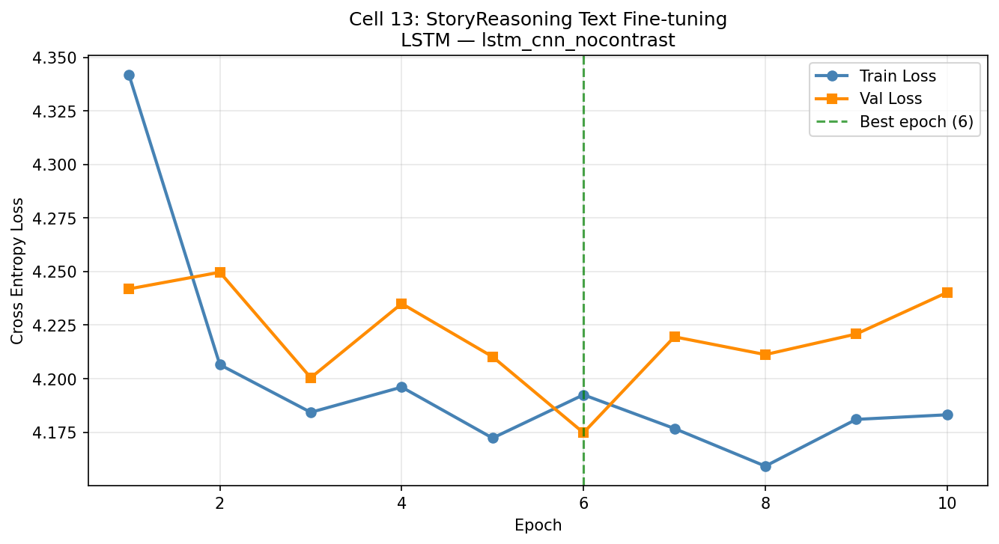
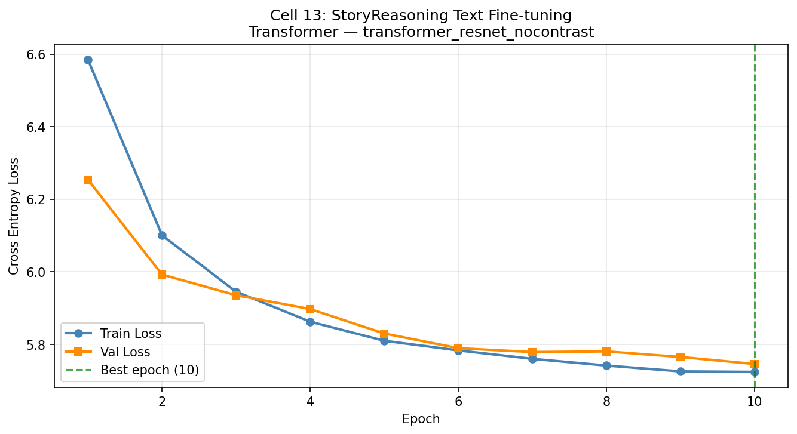
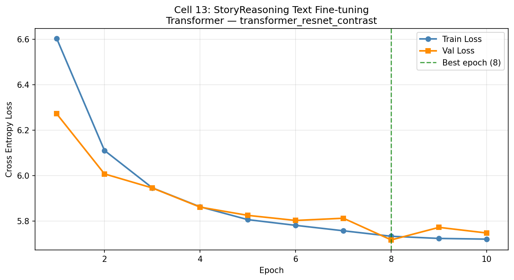

# Visual Encoder Pretraining
- Stage A: STL-10 (5,000 images, 10 categories — similar visual diversity to story frames).
- Stage B: StoryReasoning fine-tuning with dual loss (content reconstruction + context consistency). ResNet uses a lower learning rate than CNN to preserve ImageNet weights.

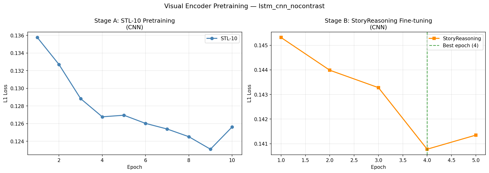
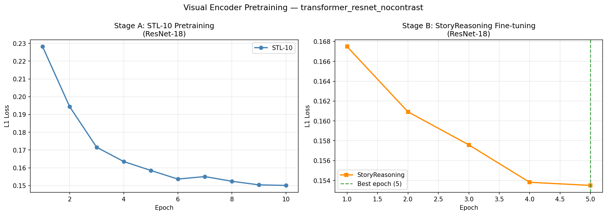
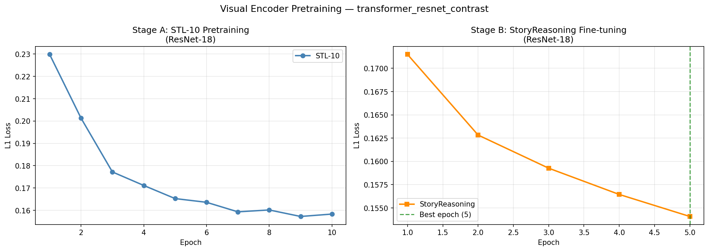

---
# Main Training 
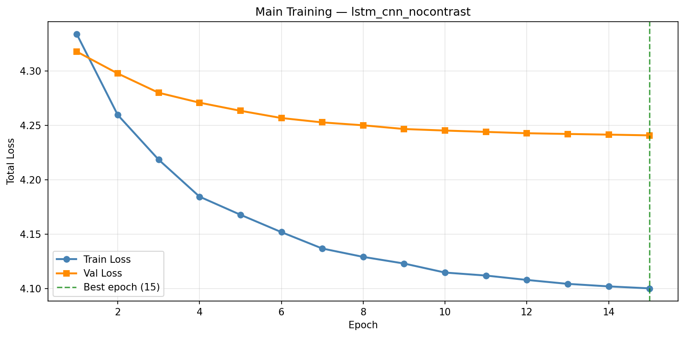
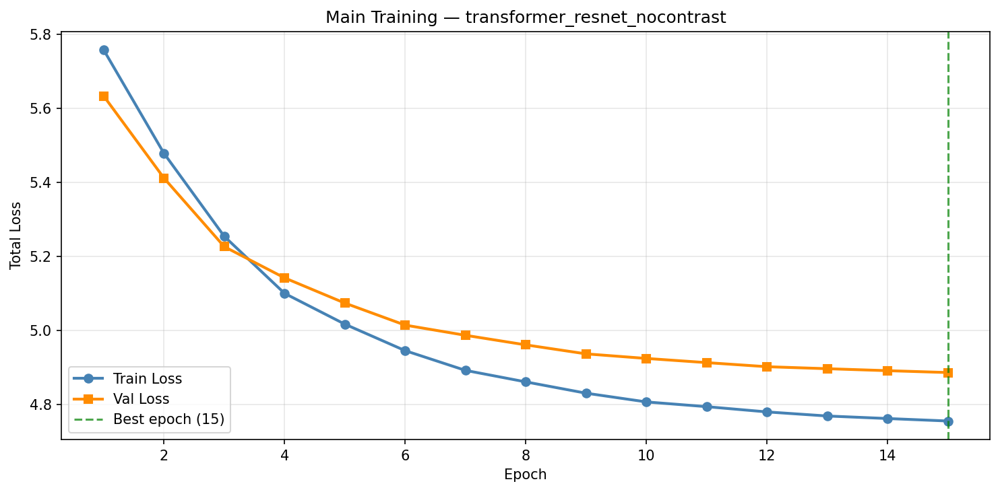
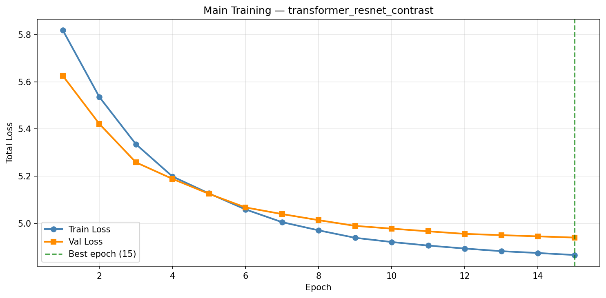

---
# Explainability
- Transformer attention heatmaps: Layer 1 self-attention weights visualised as a token × token matrix, showing which tokens the model attends to.
- Grad-CAM: Gradient-weighted class activation maps overlaid on input frames, showing which image regions most influenced the ResNet visual encoding.
- Prediction visualisation: Side-by-side of input frame, ground truth frame, and predicted frame, plus decoded predicted text vs ground truth description.

---

